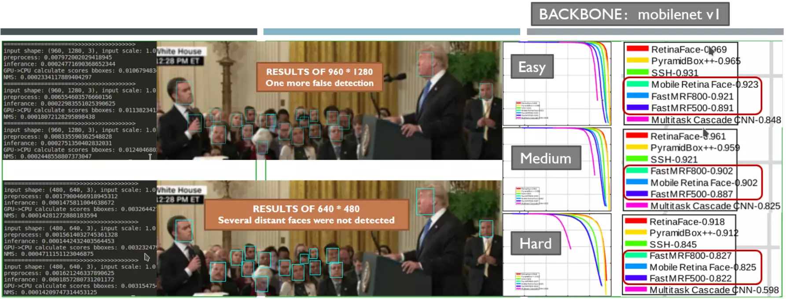
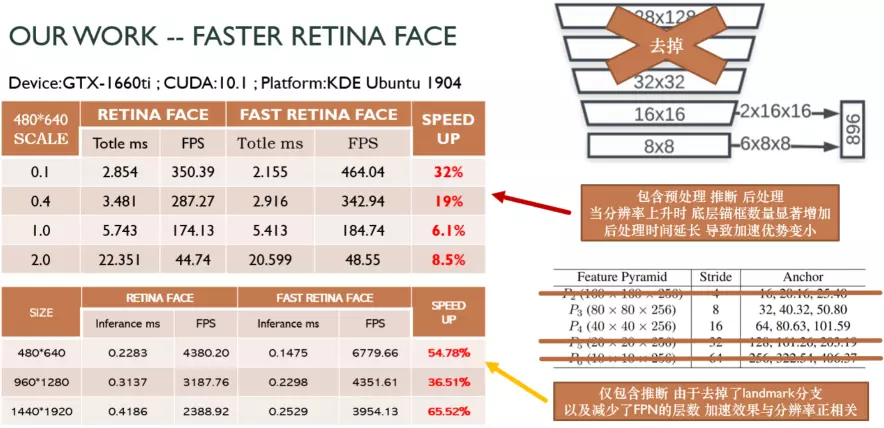

# Face Detection @ 500-1000 FPS
Reimplementation of [RetinaFace](https://github.com/deepinsight/insightface/tree/master/RetinaFace), faster and stronger.

* [RetinaFace: Single-stage Dense Face Localisation in the Wild](https://arxiv.org/abs/1905.00641)


## PR on wilder face test dataset



## Speed on GTX1660ti and Jetson-nano

* Why use Faster-RetinaFace ?

    | Plan | Inference | Postprocess | Throughput Capacity (FPS)
    | --------|-----|--------|---------
    | 9750HQ+1660TI | 0.9ms | 1.5ms | 500~1000
    | Jetson-Nano | 4.6ms | 11.4ms | 80~200
    
    If the queue is bigger enough, the throughput capacity can reach the highest.



## Citation

```
@inproceedings{deng2019retinaface,
title={RetinaFace: Single-stage Dense Face Localisation in the Wild},
author={Deng, Jiankang and Guo, Jia and Yuxiang, Zhou and Jinke Yu and Irene Kotsia and Zafeiriou, Stefanos},
booktitle={arxiv},
year={2019}
}
```